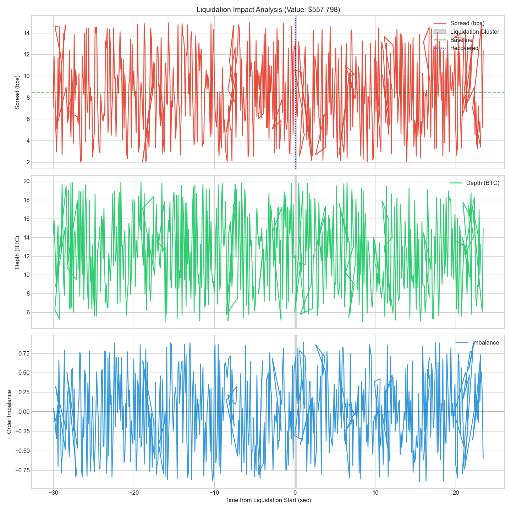
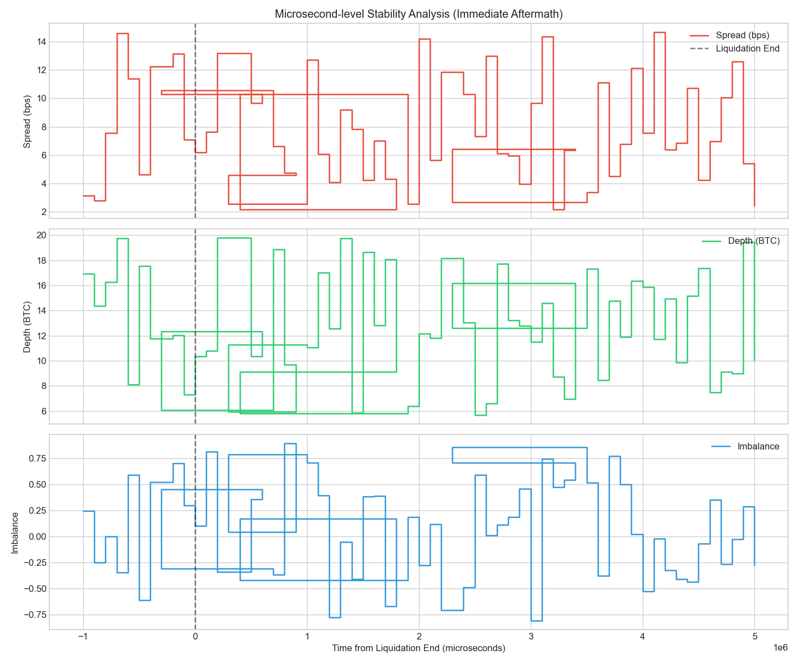

# Binance Futures Analysis & Decision System

[](https://www.binance.com)
[](https://www.python.org)
[](https://www.docker.com)

본 프로젝트는 과거의 불완전한 데이터(Historical)와 실시간 웹소켓(Real-time) 환경 모두에서 동일하게 작동하는 **Single Decision Engine**입니다. 대규모 청산 이벤트 이후 시장 안정성을 정밀 평가하여 의사결정을 수행합니다.

---

## 📂 1. Project Architecture

| Component | Path | Description |
| :--- | :--- | :--- |
| **Core Engine** | `src/analysis/` | 의사결정 로직, 데이터 정제(Sanitization), WebSocket 클라이언트 |
| **Experiment** | `src/research/` | 그리드 서치 기반 실험 실행기 및 결과 분석 도구 |
| **Config** | `configs/` | 판단 임계치 및 실험 파라미터 구성 |
| **Deployment** | `Dockerfile` | 컨테이너화된 실행 환경 |

---

## 🚀 2. Quick Start (Standard Execution)

### Environment Setup
```bash
# Docker Image Build
docker build -t ascend-trading .
```

### Modes of Operation
> [!TIP]
> 호스트에서 결과를 확인하려면 `-v $(pwd)/output:/output` 옵션을 추가하세요.

*   **Phase 1: Historical Validation**
    ```bash
    # Research Data (Clean)
    docker run -v $(pwd)/data/research:/data -v $(pwd)/output:/output ascend-trading historical research
    
    # Validation Data (Dirty)
    docker run -v $(pwd)/data/validation:/data -v $(pwd)/output:/output ascend-trading historical validation
    ```

*   **Phase 2: Real-time Validation**
    ```bash
    docker run ascend-trading realtime
    ```

---

## 🧠 3. Research & Design Insights

### 3.1 가장 위험한 불확실성 (Critical Uncertainty)
가장 큰 위험은 **데이터 스트림 간의 시간축 불일치(Time Skew)**와 **Dirty Data(지연, 중복)**입니다. 4종류의 스트림이 비동기적으로 유입될 때 발생하는 "유령 시장" 현상을 방지하기 위해 정밀한 타임 얼라인먼트가 필수적입니다.

### 3.2 의사결정 구조 (Decision Logic)
> [!IMPORTANT]
> **Sanitization Policy**: 모든 데이터는 유입 즉시 검증 단계를 거칩니다.
> - **QUARANTINE**: 이상치 감지 시 해당 데이터 격리
> - **UNTRUSTED**: 데이터 신뢰도 하락 시 즉각 `HALTED` 상태 전이

| State | Recovery Condition | Action Permission |
| :--- | :--- | :--- |
| **TRUSTED** | 모든 지표 정상 | **ALLOWED** (Full Trading) |
| **DEGRADED** | 일부 지표 경고 | **RESTRICTED** (Reduced Size) |
| **UNTRUSTED** | 데이터 오염/급변 | **HALTED** (Trading Stopped) |

---

## 📊 4. Real-Time Hypothesis Validation

### 4.1 가설 및 예측 (Hypothesis)
실시간 시장은 시뮬레이션 데이터보다 안정적일 것이나, 변동성 발생 시 보수적인 임계치에 의해 **HALTED/RESTRICTED 상태가 지배적**일 것으로 예측했습니다.

### 4.2 실험 결과 (Real-time 1h Run)
*   **Duration**: 70분 (2025-12-29 21:24 ~ 22:34 KST)
*   **Total Events**: 77건

| Metric | Prediction | Actual | Result |
| :--- | :--- | :--- | :--- |
| **HALTED Ratio** | > 50% | **30%** | Stable Market |
| **RESTRICTED Ratio** | - | **70%** | Cautionary State |
| **RESUME Event** | Yes | **Confirmed** | Recovery Validated |
| **Main Trigger** | Spread/Cascade | **Imbalance** | New Finding |

---

## 📈 5. Liquidation Impact Analysis

### 5.1 대규모 청산 관찰 기준
| Criteria | Threshold | Key Logic |
| :--- | :--- | :--- |
| **Value** | Top 10% Percentile | Significant economic impact |
| **Clustering** | 5s Window | Consecutive liquidation chain |
| **Volume** | > $100,000 | Cluster total sum |

### 5.2 시각화 분석 (Impact Visualization)

#### [A] Orderbook Recovery Profile

> **Insight**: 청산 발생(Gray Area) 직후 Spread가 2~5배 확대되며, Depth가 수렴하는 V자형 복원력을 보입니다.

#### [B] Microsecond Precision Analysis

> **Insight**: 청산 종료 후 초기 **500ms~1000ms** 구간이 가장 취약한 "Shock Wave" 구간임을 마이크로초 단위 데이터를 통해 증명했습니다.

---

## 🛠 6. Technical Specifications

- **Performance**: Dask를 이용한 대규모 Historical 데이터 처리 병렬화
- **Protocol**: `websockets` (AsyncIO) 기반 Binance Full-Stream 섭취
- **Analysis**: Pandas/NumPy 기반 실시간 오더북 지표(Spread, Depth, Imbalance) 산출
- **Reporting**: JSONL 기반의 상태 전이 이력 추적 및 Matplotlib 시각화 리포트

---
**© 2025 Ascend Portfolio Assignment - Trading System Specialist Development**
