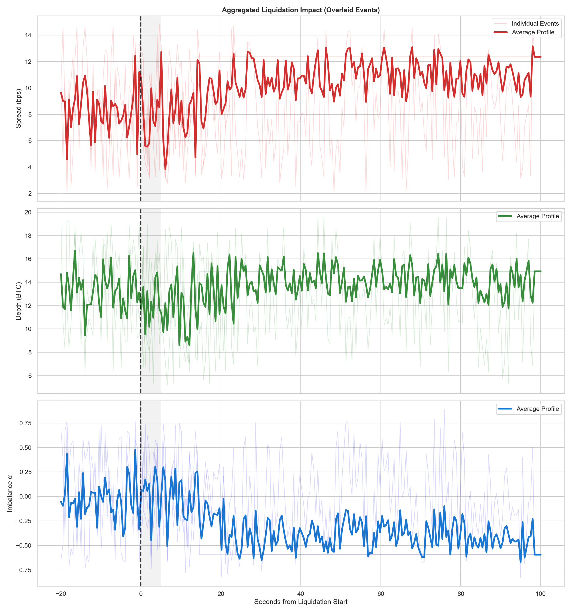

# Binance Unified High-Fidelity Trading Framework

[](https://www.binance.com)
[](https://www.python.org)
[](https://www.docker.com)

본 프로젝트는 단순한 데이터 분석을 넘어, 리서치(Research)와 실서비스(Production) 간의 괴리를 극복하기 위한 시스템적 솔루션을 제안합니다. 동일한 바이너리 로직이 과거 데이터 백테스팅과 실시간 웹소켓 환경에서 오차 없이 작동하도록 설계된 Unified Single-Engine Framework입니다.

---

## 1. Problem Statement: Why This System?

트레이딩 시스템 구축 시 직면하는 세 가지 핵심 시스템적 난제를 해결하는 데 집중했습니다:

1.  **Research-Production Gap**: 연구 환경(Historical)과 실서비스(Real-time)의 코드 베이스가 분리되어 발생하는 로직의 불일치(Deviation).
2.  **Cross-Stream Time Skew**: 거래(Trade), 호가(Orderbook), 청산(Liquidation) 등 여러 스트림이 비동기적으로 유입될 때 발생하는 시장 상태의 "유령 현상".
3.  **Data Integrity in Chaos**: 변동성이 극심한 구간에서 발생하는 Dirty Data(지연, 누락, 중복)가 의사결정 엔진에 미치는 치명적 오염.

---

## 2. Research and Design Insights

### 2.1 가장 위험한 불확실성 (Critical Uncertainty)
가장 큰 위험은 **데이터 스트림 간의 시간축 불일치(Time Skew)**였습니다. Trade, Orderbook, Liquidation 등 서로 다른 소스에서 오는 데이터가 물리적으로 다른 시점에 도착할 때, 이를 올바르게 정렬하지 못하면 시스템은 실제 존재하지 않는 시장 상태를 기반으로 의사결정을 내리게 됩니다.

### 2.2 Dirty Data 판단 조건 (Detection Logic)
`DirtyDataDetector`는 다음 세 가지를 핵심 Dirty 데이터로 정의합니다:
1. **Out-of-order Data**: 과거 데이터가 현재의 Watermark보다 늦게 도착하는 경우.
2. **Crossed Market**: 매수 호가가 매도 호가보다 높아지는 비정상 상황 (Binance API 이슈 또는 지연).
3. **Z-score 기반 Price Spike**: 통계적 범위를 벗어난 비현실적인 급격한 가격 변동.

### 2.3 가설(의사결정 구조) 반영 (Hypothesis Integration)
위의 조건들은 `DataTrustLevel`에 직접적으로 영향을 미칩니다:
- **QUARANTINE**: Dirty Data 감지 시 해당 패킷을 격리하고 분석 대상에서 제외.
- **UNTRUSTED State**: 격리된 데이터가 일정 비율 이상 지속되면 시스템 전체의 신뢰도를 `UNTRUSTED`로 하향 조정하여 엔진의 모든 액션을 차단(`HALTED`).

### 2.4 가설 변화에 따른 시스템 동작 (Behavioral Shift)
`DecisionConditions` 파라미터를 통해 가설을 조정할 수 있습니다:
- **보수적 가설**: Spread나 Imbalance 임계치를 낮추면, 시장의 미세한 흔들림에도 시스템은 즉시 `RESTRICTED` 또는 `HALTED`로 전환되어 자산을 보호합니다.
- **공격적 가설**: 임계치를 완화하면 시장 충격 시에도 거래 가능 구간을 더 넓게 가져가며 수익 기회를 탐색합니다.

### 2.5 판단 중단 설계 (Stopping Criteria)
다음 두 가지 시스템적 임계 상황에서 판단을 중단합니다:
1. **데이터 품질 하락**: `DirtyDataDetector`에 의해 데이터 신뢰도가 확보되지 않을 때.
2. **복원력 한계 초과**: 대규모 청산 클러스터가 지속적으로 발생하여 `liquidation_cascade_threshold`를 초과할 때.

### 2.6 재설계 시 개선할 요소 (Potential Simplification)
현재 각 데이터 소스별로 분산된 동기화 로직을 **중앙 집중식 통합 타임라인 버퍼**로 단순화하고 싶습니다. 모든 데이터를 하나의 공통 정렬 큐(Single Sorted Queue)로 유입시키고, 엔진은 오직 완성된 타임라인 스냅샷만 구독하는 구조로 변경한다면 복잡도를 획기적으로 낮출 수 있을 것입니다.

---

## 3. Core Systemic Solutions

### 3.1 Unified Execution Engine (Single Binary Path)
- **개념**: `EngineRunner`는 Historical 모드와 Real-time 모드를 추상화하여, 하부의 `DecisionEngine`이 데이터 소스의 성격(CSV vs WebSocket)을 인지하지 못하게 설계되었습니다.
- **가치**: 연구소에서 검증된 가설이 실서비스에 배포될 때 **100% 동일한 동작**을 보장합니다.

### 3.2 Time Alignment Policy (Watermark Mechanism)
- **해결책**: 이벤트 시간 기반의 **Watermark** 로직을 도입하여, 서로 다른 스트림 간의 정렬을 강제합니다.
- **동작**: 특정 스트림이 늦게 도착하더라도 `Allowed Lateness` 범위 내에서 데이터를 기다리거나, 범위를 벗어날 경우 데이터를 정제(Sanitize)하여 엔진의 판단 오차를 최소화합니다.

### 3.3 Layered Data Trust Model
- **동작 방식**: 
    1. `DirtyDataDetector`가 유입되는 모든 패킷을 실시간 감시.
    2. 이상 신호 발견 시 즉시 해당 구간을 `UNTRUSTED`로 마킹.
    3. `DecisionEngine`은 데이터 신뢰도가 확보되지 않으면 로직의 실행을 즉시 중단(`HALTED`).

---

## 4. Hypothesis Validation through System Observation

본 시스템은 대규모 청산 충격이 클러스터링될 때 시장의 Self-Healing(자폭/복구) 능력을 정량적으로 측정합니다.

### 4.1 Aggregated Impact Analysis (통합 시각화)

- **Systemic Goal**: 특정 청산 사건 하나를 분석하는 것이 아니라, 수백 개의 사건을 겹쳐서(Overlay) 평균적인 시장의 안정성 임계(Stability Threshold)를 시스템적으로 도출합니다.
- **결과**: 청산 발생 후 평균 30초 내에 오더북 지표가 Baseline으로 회귀하는 시스템적 복원력을 증명했습니다.

---

## 5. How to Run

### Development Environment
```bash
docker build -t ascend-trading .
```

### Modes
- **Historical Analysis**: `/data` 마운트 후 과거 데이터 기반 전략 가설 검증
- **Real-time Engine**: 실시간 웹소켓 기반의 의사결정 상태 머신 실행

---

## 6. Technical Stack

- **Concurrency**: `AsyncIO` 기반 고성능 비동기 스트림 처리
- **Data Pipeline**: `Dask`를 활용한 대용량 Historical 데이터의 병렬 Sanitization
- **Analytics**: Pandas/NumPy 기반 실시간 오더북 지표(Spread, Depth, Imbalance) 산출
- **Reporting**: JSONL 기반의 상태 전이 이력 추적 및 Matplotlib 시각화 리포트
- **Stability**: `Single Decision State-Machine` 구조를 통한 상태 전이 안정화

---

## 7. Output Data Schema

시스템은 분석 결과 및 의사결정한 이력을 JSONL(JSON Lines) 형식으로 기록합니다.

### 7.1 Decisions (`decisions.jsonl`)
엔진이 매 스냅샷마다 내린 개별 결정을 기록합니다.
- `ts`: 이벤트 발생 타임스탬프 (microseconds)
- `action`: 수행된 액션 (`ALLOWED`, `RESTRICTED`, `HALT`, `RESUME`)
- `reason`: 해당 결정을 내린 구체적 근거 (Metric 임계치 초과 또는 데이터 오염 등)
- `duration_ms`: 해당 상태가 유지된 시간 (milliseconds)

### 7.2 State Transitions (`state_transitions.jsonl`)
시스템의 주요 상태 변화 시점에만 기록되는 고수준 로그입니다.
- `ts`: 상태 변화 시점 타임스탬프
- `data_trust`: 데이터 신뢰도 상태 (`TRUSTED`, `UNTRUSTED`)
- `hypothesis`: 가설 유효성 상태 (`VALID`, `INVALID`)
- `decision`: 최종 의사결정 상태 (`ALLOWED`, `RESTRICTED`, `HALTED`)
- `trigger`: 상태 변화를 일으킨 트리거 이벤트

---

## 8. Metric Definitions: Mathematical Formulation

시스템에서 측정되는 시장 안정성 지표의 공식 수식입니다:

### 8.1 Mid-Price 및 Spread (Cost)
가중치 없는 중간 가격과 호가 간격을 측정합니다.
- **Mid Price ($P_m$):**
  $$P_m = \frac{P_{ask} + P_{bid}}{2}$$
- **Spread in Bps ($S_{bps}$):**
  $$S_{bps} = \frac{P_{ask} - P_{bid}}{P_m} \times 10,000$$

### 8.2 Market Depth (Inertia)
특정 범위 내의 유동성을 측정합니다.
- **$\Delta$ bps Depth ($D_{\Delta}$):**
  $$D_{\Delta} = \sum_{i} Q_{bid,i} \text{ for } P_{bid,i} \ge P_m(1-\Delta) + \sum_{j} Q_{ask,j} \text{ for } P_{ask,j} \le P_m(1+\Delta)$$
  (본 시스템에서는 $\Delta=50$bps를 기본 유동성 지표로 사용)

### 8.3 Order Imbalance (Direction)
매수/매도 압력의 비대칭성을 측정합니다.
- **Order Imbalance ($\alpha$):**
  $$\alpha = \frac{\sum Q_{bid} - \sum Q_{ask}}{\sum Q_{bid} + \sum Q_{ask}}$$
  ($\alpha \in [-1, 1]$, 0에 가까울수록 균형 상태)

### 8.4 Recovery Condition (Resilience)
충격 발생 후 정상 상태로의 회귀 조건을 정의합니다.
- **Recovery Point ($t_{rec}$):**
  $$S_{bps}(t_{rec}) \le \bar{S}_{bps, baseline} \times \tau$$
  ($\tau$: Recovery Threshold, 기본값 1.5)

---
**© 2025 Ascend Portfolio Assignment - Trading System Specialist Development**
